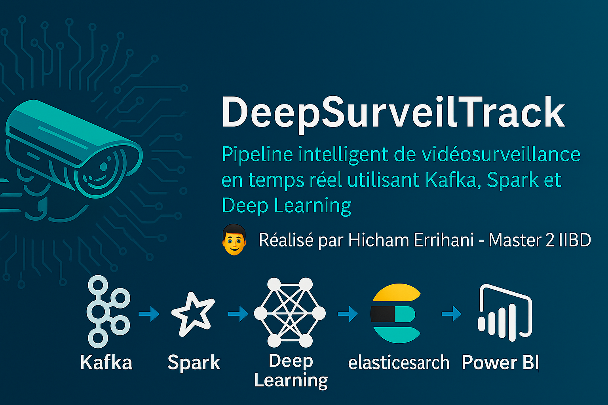

<!-- 📸 BANNIÈRE DU PROJET -->
<p align="center">
  
</p>

<!-- 🔥 EN-TÊTE DU PROJET -->
<h1 align="center">🚀 DeepSurveilTrack</h1>

<p align="center">
  🎥 <strong>Pipeline intelligent de vidéosurveillance en temps réel</strong><br>
  utilisant <code>Kafka</code>, <code>Spark</code> et <code>Deep Learning</code> pour l’analyse automatisée d’images.
</p>

<!-- 🎨 BADGES STYLÉS ET ALIGNÉS -->
<p align="center">
  
  
  
  
  
  
  
  
  
  
  
</p>

---

<p align="center">
  👨‍💻 <strong>Réalisé par Hicham Errihani</strong> — Master 2 IIBD
</p>


---

## 🎯 Objectifs du Projet

Le projet **DeepSurveilTrack** vise à concevoir un pipeline de vidéosurveillance intelligent, capable de :

- 📤 **Envoyer des images** (frames) à travers Apache Kafka
- ⚙️ **Traiter les flux en temps réel** via Apache Spark Streaming
- 🧠 **Analyser les images** grâce à l’intégration future d’un modèle Deep Learning
- 📊 (Optionnel) **Visualiser les résultats** avec Kibana, Power BI ou tout autre tableau de bord

🎓 Ce projet s’inscrit dans une démarche de fin d’études en Master 2 IIBD — **Ingénierie Informatique & Big Data**

---

## 💼 Cas d’usage envisagés

### 🔐 Sécurité intelligente
> Analyse de vidéos en direct dans des zones sensibles : détection d’intrusion, surveillance automatique, alertes temps réel.

### 🏭 Industrie 4.0
> Contrôle visuel des lignes de production, détection d’erreurs ou d’interruptions, optimisation de la chaîne logistique.

### 🏙️ Ville intelligente (Smart City)
> Suivi de circulation, gestion de flux vidéo urbains, prévention des incidents publics.

### 🚚 Logistique & entrepôts
> Suivi visuel de la préparation de commandes, reconnaissance automatique d’objets, traçabilité des colis.

---

📌 Ce projet a été pensé pour être **modulaire**, **scalable** et facilement **intégrable dans un environnement industriel ou urbain**.


---

## 📦 Arborescence du projet

```text
DeepSurveilTrack/
├── configs/                  # 🔧 Fichiers de configuration globaux
├── data/                     # 📂 Données brutes : images, logs, etc.
├── docker/                   # 🐳 Environnement Docker
│   └── kafka/                # └─📦 Kafka + docker-compose.yml
├── docs/                     # 📝 Documentation, visuels, bannières
├── env/                      # 🐍 Environnement Python virtuel
├── models/                   # 🤖 Modèles IA sauvegardés ou préchargés
├── notebooks/                # 📓 Notebooks Jupyter d'exploration
├── scripts/                  # 🛠️ Scripts utilitaires (nettoyage, test…)
├── src/                      # 💻 Code source principal
│   ├── producer/             # └─📤 Envoi de frames (Kafka Producer)
│   └── consumer/             # └─⚙️ Traitement Spark (Consumer)
├── tests/                    # ✅ Tests unitaires / fonctionnels
├── run_all.sh                # 🚀 Script global d’exécution du pipeline
├── requirements.txt          # 📦 Liste des dépendances Python
└── README.md                 # 🧾 Documentation principale du projet

